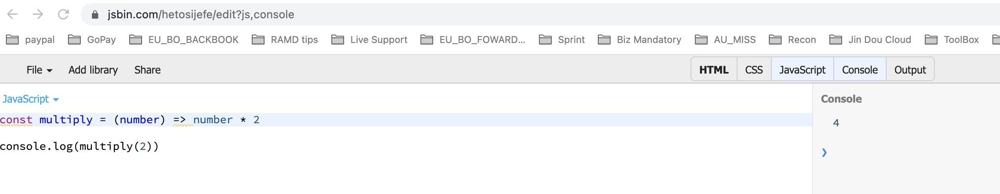
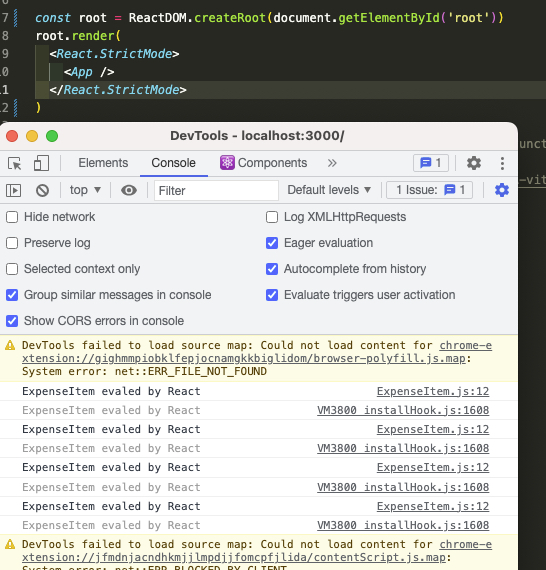
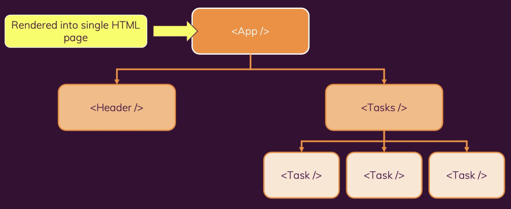
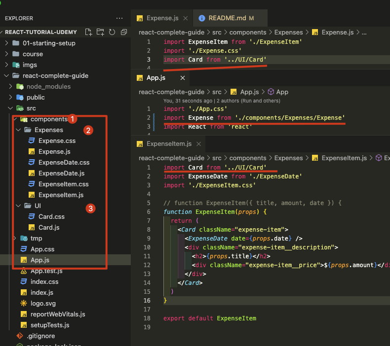
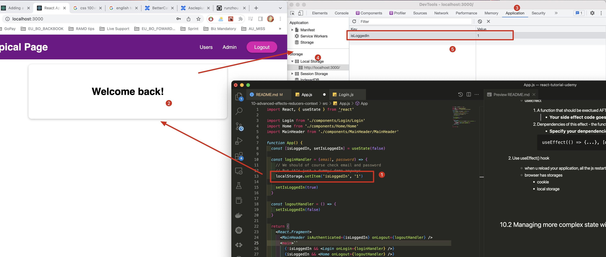

# Tips
## 1. how to debug in chrome DevTools
1. go to sources
2. command + P to navigate your target file
3. set breakpoint
4. debug just like in VSC

## 2. how to change theme to dark
1. shift + command + P
2. type `dark`

## 3. Setup
```bash
# setup repository
$ npm set registry https://npm.<some-repository>.com
```


# react-tutorial-udemy

[This is the React tutorial](https://pplearn.udemy.com/course/react-the-complete-guide-incl-redux)
[git link](https://github.com/academind/react-complete-guide-code/tree/master)
[style-components (css)](https://styled-components.com/)

<br><br><br>

## 1.1 Problem I need to solve

1. how to send Get/Post request from React to DB

2. How to expand result square

3. CSS

   - 1rem(root element) = 16px(pixels)
   - [margin](https://developer.mozilla.org/en-US/docs/Web/CSS/margin)

     - sets the margin area on all four sides of an element.
     - 1rem auto (1rem - up and bottom length. auto - to the left length)
     - sample

       ```css
       /* Apply to all four sides */
       margin: 1em;
       margin: -3px;

       /* top and bottom | left and right */
       margin: 5% auto;

       /* top | left and right | bottom */
       margin: 1em auto 2em;

       /* top | right | bottom | left */
       margin: 2px 1em 0 auto;
       ```

   - [margin-top](https://developer.mozilla.org/en-US/docs/Web/CSS/margin-top)

     - sets the margin area on the top of an element.

   - [position](https://developer.mozilla.org/en-US/docs/Web/CSS/position)

     - sets how an element is positioned in a document.
     - sample

       ```css
        /* 1. sticky */
        it will move will u scroll down the cursor

        /* 2. fixed */

        /* 3. absolute */
        will overlap another element

        /* 4. relative */
        wont overlap another element
       ```

   - [justify-content](https://developer.mozilla.org/en-US/docs/Web/CSS/justify-content)
   - [top](https://developer.mozilla.org/en-US/docs/Web/CSS/top)
     - Vertical position from top to bottom
   - [left](https://developer.mozilla.org/en-US/docs/Web/CSS/left)
     - horizontal position from left to right
   - [height](https://developer.mozilla.org/en-US/docs/Web/CSS/height)
     - the element box height
   - [width](https://developer.mozilla.org/en-US/docs/Web/CSS/width)
     - the element box width
   - [background-color](https://developer.mozilla.org/en-US/docs/Web/CSS/background-color)
     - the background color of an element
   - [color](https://developer.mozilla.org/en-US/docs/Web/CSS/color)
     - sets the foreground color value of an element's text and text decorations, and sets the currentcolor value
   - [display](https://developer.mozilla.org/en-US/docs/Web/CSS/display)
     - sets whether an element is treated as a block or inline element and the layout used for its children, such as flow layout, grid or flex.
   - [align-items](https://developer.mozilla.org/en-US/docs/Web/CSS/align-items)
     - sets the align-self value on all direct children as a group.
   - [padding](https://developer.mozilla.org/en-US/docs/Web/CSS/padding)

     - sets the padding area on all four sides of an element at once.
     - sample

       ```css
       /* Apply to all four sides */
       padding: 1em;

       /* top and bottom | left and right */
       padding: 5% 10%;

       /* top | left and right | bottom */
       padding: 1em 2em 2em;

       /* top | right | bottom | left */
       padding: 5px 1em 0 2em;
       ```

   - [box-shadow](https://developer.mozilla.org/en-US/docs/Web/CSS/box-shadow)

     - adds shadow effects around an element's frame. You can set multiple effects separated by commas.
     - sample

     ```css
     /* Keyword values */
     box-shadow: none;

     /* offset-x | offset-y | color */
     box-shadow: 60px -16px teal;

     /* offset-x | offset-y | blur-radius | color */
     box-shadow: 10px 5px 5px black;

     /* offset-x | offset-y | blur-radius | spread-radius | color */
     box-shadow: 2px 2px 2px 1px rgba(0, 0, 0, 0.2);

     /* below sample parameter*/
     box-shadow: 0 2px 8px gold;
     ```

     - <br><br><br>

   - [z-index](https://developer.mozilla.org/en-US/docs/Web/CSS/z-index)

   - [border-radius](https://developer.mozilla.org/en-US/docs/Web/CSS/border-radius)

     - rounds the corners of an element's outer border edge.

   - [border](https://developer.mozilla.org/en-US/docs/Web/CSS/border)

     - sets an element's border. It sets the values of border-width, border-style, and border-color.

       ```css
       /* style */
       border: solid;

       /* width | style */
       border: 2px dotted;

       /* style | color */
       border: outset #f33;

       /* width | style | color */
       border: medium dashed green;
       ```

     - border: 2px solid #dd3562 (2px - border 4 side length. solid, border type. #dd3562, border color)
       - <br><br><br>

   - [rgb()](https://developer.mozilla.org/en-US/docs/Web/CSS/color_value/rgb)

     - The rgb() functional notation expresses a color according to its red, green, and blue components. An optional alpha component represents the color's transparency.
     - sample

       ```css
        /* Syntax with space-separated values */
        rgb(255 255 255)
        rgb(255 255 255 / .5)

        /* Syntax with comma-separated values */
        rgb(255, 255, 255)
        rgb(255, 255, 255, .5)

        /* Legacy rgba() syntax */
        rgba(255 255 255)
        rgba(255 255 255 / .5)

       ```

4. we set button as `button` so it wont submit form

   - `<button type="button" />`

5. form use with button

```js
<form onSubmit={handleSubmit}>
  <button type="submit">
  Add Expense
  </button>
<form>
```

6. pass css style to jsx, it's an object

```js
<form onSubmit={formSubmitHandler}>
  <div className="form-control">
    <label style={{ color: !isValid ? 'red' : 'black' }}>Course Goal</label>
    <input type="text" onChange={goalInputChangeHandler} />
  </div>
  <Button type="submit">Add Goal</Button>
</form>
```

7. start a new react project

```bash
$ npx create-react-app my-app
$ cd my-app
$ npm start
```

8. track and update variable

   ```js
   const handleUserSubmit = (event) => {
     event.preventDefault()
     console.log(enteredUsername, enteredAge)
     setEnteredUsername('')
     setEnteredAge('')
   }

    // From
   <input id="usernames" type="text" onChange={handleUsernameChange} />

    // To
   <input id="usernames" type="text" value={enteredUsername} onChange={handleUsernameChange} />
   ```

9. convert string to number

```bash
# FROM
enteredAge
# TO
+enteredAge
```

10. html element

    1. [`<section>`](https://developer.mozilla.org/en-US/docs/Web/HTML/Element/section)

       - a generic standalone section of a document, which doesn't have a more specific semantic element to represent it.

    2. [`<span>`](https://developer.mozilla.org/en-US/docs/Web/HTML/Element/span)
       - an inline element. a generic inline container for phrasing content, which does not inherently represent anything

<br><br><br>

## 1.2

1. start a cloned react project

```bash
$ npm install
$ npm start
```

2. [jsbin](https://jsbin.com/hetosijefe/edit?js,console) live js tool

   - <br><br><br>

3. StrictMode will call each function twice

   - StrictMode
     - <br><br><br>
   - **without** StrictMode
     - <br><br><br>

4. key point
   - two way binding `value` & `setValue('')`

<br><br><br>

## 1.3 Questions

1. what are rem in CSS

   - In CSS rem stands for “root em”, a unit of measurement that represents the font size of the root element.

2. why we need event.preventDefault()?

# 1. Getting Started

## 1.1 What is React.js

1. A JS libraryfor building user interface
2. React.js

   - A client-side JS lib
   - all about building modern, reactive user interfaces for the web
   - Declarative, component-focused approach

3. JavaScript

   - JS runs in the browser - on the loaded page
   - U can manipulate the HTML structure (DOM) of the page
   - No (visible) request to the server required, no need to wait for a new HTML page as a responses

4. [react-vs-vanilla-js-example](https://github.com/academind/react-complete-guide-code/tree/01-getting-started/code/react-vs-vanilla-js-example)

5. React make the code much lesser than javascript

6. Building Single-Page-Applications (SPAs)
   - React can be used to **control parts** of HTML pages or entire pages
     - Widget approach on a multi-page-application. Some pages are still rendered on and served by a backend server
   - React can also be used to control the entire frontend of a web application
     - SPA approcah. Server only sends one HTML page, thereafter, React takes over and controls the UI

## 1.2 Alternatives

1. Angular

   - Complete component-based UI framework, packed with features. Uses TypesScript. Can be overkill for smaller projects

2. React.js

   - Lean and focused component-based UI libarary, Certain features (e.g. routing) are added via commuinity packages

3. Vue.js
   - Complete component-based UI framework, includes most core features. A bit less popular than React & Angular

## 1.3 Course outline

0. Thery/ Small Demos & Examples + More Realistic (Bigger) Example Projects + Challenges & Exercises

1. Basics & Foundaion (Introducing Key Features)

   - Components & Building UIS
   - Working with Events & Data: "props" and "State"
   - Styling React Apps & Components
   - Introduction into "React Hooks"

2. Advanced Concepts (Building for Production)

   - Side Effects, "Refs" & More React Hooks
   - React's Context API & Redux
   - Forms, Http Requests & "Custom Hooks"
   - Routing, Deployment, NextJS & More

3. Summaries & Refreshers (Optimizing ur time)
   - JS Refresher
   - ReactJS Summary

## 1.4 Course path

1. Standard Approach

   - Start with lecture 1 in section 1 and go through the course step by step
   - Skip JS refresher module if u dont need it
   - Use React summary module at the end to summarize what u learned or to refresh knowledge in the future

2. Summary Approach

   - Skip forward to the React summary module
   - Optionally also taks JS refresher module if u need it
   - Go through the entire course after going through the summary module and/ or if u got more time in the future

3. Get the most of the course
   - Watch the videos
   - Code along & practivce
   - Debug Errors & Explore Solutions
   - Help each other & learn together

## 1.5 code editor

1. VSCODE

2. extensions
   - Prettier
   - Material Icon theme
   - Color theme: Monokai
   - File Icon theme: Material Icon theme

<br><br><br><br><br><br>

# 2. JS refresher

Next-Gen JavaScript

<br><br><br>

## 2.1 Basics

### 2.1.1 let & const (introduced after ES6)

1. let

   - create a variable that really is a variable

2. const

   - planned to creat a constant value

3. [jsbin](https://jsbin.com/?html,output)

   ```js
   console.log('test of var')
   var myName = 'Rick'
   console.log(myName)

   myName = 'Byun'
   console.log(myName)
   console.log('------\n\n')

   console.log('test of let')
   let herName = 'Rick'
   console.log(myName)

   herName = 'Time'
   console.log(herName)
   console.log('------\n\n')

   console.log('test of const')
   const yourName = 'Eve'
   console.log(yourName)

   yourName = 'Maru'
   console.log(yourName)
   console.log('------\n\n')
   ```

   - <br><br><br>

<br><br><br>

### 2.1.2 Arrow functions

```js
// 1. sync format
function myFunc(){
   ...
}

const myFuc = () => {
   ...
}

// 2. example
function printMyName(name) {
  console.log(name)
}
printMyName('Rick')


const printMyName2 = (name) => {
  console.log(name)
}
printMyName2('Eve')

// 3. if one argument only
const printMyName2 = name => {
  console.log(name)
}
printMyName2('Eve')

// 4. if no argument
const printMyName2= () => {
  console.log('Rick')
}
printMyName2()

// 5. if more than one parameters
const printMyName2= (name, age) => {
  console.log(name, age)
}
printMyName2('Eve', 18)

// 6. oneline
const multiply = (number) => {
   return number * 2
}
console.log(multiply(2))

// 6.2 another version
const multiply = (number) => number * 2
console.log(multiply(2))

```

<br><br><br>

### 2.1.3 Exports & Imports (Modules)

```js
// 1. person.js
const person = {
   name: 'Rick'
}
export default person

// utility.js
export const clean = () => {...}
export const baseData = 10

// 2. utility.js
// Import default and ONLY export of the file Name in the receiving file is up to u
// As person is the default, whatevert the name u choose, it will still be 'person'
import person from './person.js'
import prs from './person.js'


// 3. app.js
// named imports. defined by export
// we need give exactly name as it's not default export
import { baseData } from './utility.js'
import { clean as cLeAn} from './utility.js'
import * as bundled from './utility.js'
   bundled.baseData
   bundled.cLeAn
```

<br><br><br>

### 2.1.4 Understanding Classes

1. Class - the blueprint

```js
class Person {
   name = 'Rick' // property
   call = () => {...} // Method
}

// Usage (constructor funcions anyone?)
const myPerson = new Person()
myPerson.call()
console.log(myPerson.name)

// inheritance (prototypes anyone?)
class Person extends Master
```

2. example

```js
class Human {
  constructor() {
    this.gender = 'male'
  }

  printGender() {
    console.log(this.gender)
  }
}

class Person extends Human {
  constructor() {
    super()
    this.name = 'Rick'
    this.gender = 'female'
  }

  printMyName() {
    console.log(this.name)
  }
}

const person = new Person()
person.printMyName()
person.printGender()
```

<br><br><br>

### 2.1.5 Classes, Properties & Methods

1. next gen js change

```js
// 1. Properties are like "variables attached to classes/ objects"
// Methods are like "functions attached to classes/ objects"

// ES6
constructor(){
   this.myProperty = 'value'
}
myMethod(){...}

// ES7
myProperty = 'value'
myMethod = () => {...}

```

2. example

```js
class Human {
  gender = 'male'

  printGender = () => {
    console.log(this.gender)
  }
}

class Person extends Human {
  name = 'Rick'
  gender = 'female'

  printMyName = () => {
    console.log(this.name)
  }
}

const person = new Person()
person.printMyName()
person.printGender()
```

<br><br><br>

### 2.1.6 Spread & Rest Operators

1. Syntax

```js
...

// Spread: Used to split up array elements OR object properties
const newArray = [...oldArray, 1, 2]
const newObject = {...oldObject, newProp: 5}

// Rest: Used to merge a list of function arguments into an array
function sortArgs(...args){
   return args.sort()
}
```

2. Example

```js
// 1. Spread
// 1.1
const numbers = [1, 2, 3]
const newNumbers = [...numbers, 4]
console.log(newNumbers)

// 1.2
const person = {
  name: 'Rick',
}
const newPerson = {
  ...person,
  age: 29,
}
console.log(newPerson)

// 2. Rest
const filter = (...args) => {
  return args.filter((el) => el === 1)
}

console.log(filter(1, 2, 3))
```

<br><br><br>

### 2.1.7 [Destructuring](https://developer.mozilla.org/en-US/docs/Web/JavaScript/Reference/Operators/Destructuring_assignment)

1. Easily extract array element or object properties and store them in variables

   - Array Destructuring

     ```js
     const [a, b] = ['Hello', 'Rick']
     console.log(a) // Hello
     console.log(b) // Rick
     ```

   - Object Destructuring

     ```js
     const { name } = { name: 'Rick', age: 29 }
     console.log(name) // Rick
     console.log(age) // 29
     ```

2. example

```js
const numbers = [1, 2, 3]
const [num1, , num3] = numbers
console.log(num1, num3)
```

<br><br><br>

### 2.1.8 Reference and Primitive Types Refresher

1. Reference Copy (same as array)
   1. Rick stored in memory
   2. assign the pointer to person
   3. secondPerson was assigned the `pointer` from person
   4. so even we change `person.name`, secondPerson will also change. As both point to the same memory

```js
const person = {
  name: 'Rick',
}
const secondPerson = person
person.name = 'Maru'
console.log(secondPerson)
```

2. Real object copy `this is immutable`
   1. secondPerson wont change

```js
const person = {
  name: 'Rick',
}
const secondPerson = {
  ...person,
}
person.name = 'Maru'
console.log(secondPerson)
```

<br><br><br>

### 2.1.9 Refreshing Array Methods

1. map(): take function as input

```js
const numbers = [1, 2, 3]
const doubleNumArray = numbers.map((num) => {
  return num * 2
})
console.log(numbers)
console.log(doubleNumArray)
```

<br><br><br>

## 2.2 Summary

1. Exercise
   - Your task is to add the missing logic to a transformToObjects() function that transforms a list of numbers into a list of JavaScript objects. For the provided input [1, 2, 3] the transformToObjects() function should return [{val: 1}, {val: 2}, {val: 3}].

```js
function transformToObjects(numberArray) {
  // Todo: Add your logic
  // should return an array of objects
  return numberArray.map((num) => {
    return { val: num }
  })
}
const numbers = [1, 2, 3]
console.log(transformToObjects(numbers))
```

2. [JS array function](https://pplearn.udemy.com/course/react-the-complete-guide-incl-redux/learn/lecture/8199160#content)

   - map() => https://developer.mozilla.org/en-US/docs/Web/JavaScript/Reference/Global_Objects/Array/map
   - find() => https://developer.mozilla.org/en-US/docs/Web/JavaScript/Reference/Global_Objects/Array/find
   - findIndex() => https://developer.mozilla.org/en-US/docs/Web/JavaScript/Reference/Global_Objects/Array/findIndex
   - filter() => https://developer.mozilla.org/en-US/docs/Web/JavaScript/Reference/Global_Objects/Array/filter
   - reduce() => https://developer.mozilla.org/en-US/docs/Web/JavaScript/Reference/Global_Objects/Array/Reduce?v=b
   - concat() => https://developer.mozilla.org/en-US/docs/Web/JavaScript/Reference/Global_Objects/Array/concat?v=b
   - slice() => https://developer.mozilla.org/en-US/docs/Web/JavaScript/Reference/Global_Objects/Array/slice
   - splice() => https://developer.mozilla.org/en-US/docs/Web/JavaScript/Reference/Global_Objects/Array/splice
     - splice(startIndex, deleteCount, item1)

<br><br><br><br><br><br>

# 3. React Basics & Working With Components

https://github.com/academind/react-complete-guide-code/tree/04-react-state-events

<br><br><br>

## 3.1 React Core Synxtax & JSX

### 3.1.1 What are Components?

1.  All user interfaces in the end are made up of components
2.  why components?
    - Reusability
      - Dont repeat yourself
    - Separation of Contents
      - Dont do too many things in one and the same place(function)
    - split big chunck of code into multiple smaller functions
      - <br><br><br>

- <br><br><br>

<br><br><br>

### 3.1.2 How is A Component built?

1. React = HTML + JS + CSS
2. React & Components
   1. React allows you to create re-usable and reactive components consisting of HTML and JS (and CSS)
   2. Declarative Approach
   3. Define the desired target state(s) and let React figure out the actual JS DOM instructions

<br><br><br>

### 3.1.3 Creating a new Recat Project

1. insllation

   - install [node.js](https://nodejs.org/en/)
   - install [facebook/create-react-app](https://github.com/facebook/create-react-app)

2. if download as zipfile
   ```bash
   $ npm install
   $ npm start
   ```

<br><br><br>

### 3.1.4 Analyzing a standard react project

1. index.js - this will be executed whenever React started
   - get `root` element and saved as const
   - tell react what should be rendered(`<App />`) inside root
   - JSX syntax, write html element inside js
2. package.json/ package-lock.json - React lib
3. public/index.html - interface where React should drive the user-interface into

<br><br><br>

### 3.1.5 JSX

1. transformed code in browser
   - <br><br><br>

### 3.1.6 How React works?

```js
import logo from './logo.svg'
import './App.css'

function App() {
  // 1. traditional JS to add element called Imperative
  //    1.1 Giving clear insturction, clear steps to tell what JS and browser should be doing
  const para = document.createElement('p')
  para.textContent = 'This is also visible'
  document.getElementById('root').append(para)

  // 2. React JSX called Declarative
  return (
    <div>
      <h2>Let's get started</h2>
      <p>This is also visible</p>
    </div>
  )
}

export default App
```

<br><br><br>

## 3.2 Working with Components

1. Customized component must start with `Upper case`
2. You must only have `one` root element per return statement/ per jsx term
3. [css link](https://github.com/academind/react-complete-guide-code/blob/03-react-basics-working-with-components/extra-files/ExpenseItem.css)
   - <br><br><br>

<br><br><br>

## 3.3 Working with Data

1. curly braces `{}` to receive value
2. `const expenseDate = new Date(2023, 3, 5)` this is Date object, you cannot return directly. returned as `expenseDate.toISOString()`
3. Passing data via 'Props'

   - receive via `props`
   - <br><br><br>

   - [Date.toLocaleString()](https://developer.mozilla.org/en-US/docs/Web/JavaScript/Reference/Global_Objects/Date/toLocaleString)

<br><br><br>

## 3.4 Split Components

- <br><br><br>

<br><br><br>

## 3.5 Composition

1. Card - extract common attribute
   - `to reuse duplicate css/ html/ js code`
2. `props.children` is a default prop used between `<b>{props.chilren}</b>`
   - <br><br><br>

## 3.6 Summary

<br><br><br>

### 3.6.1 closer look at JSX

1. In old React project, u need `import React from 'react'`. As it transformed JSX to call method React

   ```js
   return React.createElement('div', {})
   ```

   ```js
   // 1. Current React format
   function App() {
     return (
       <div>
         <h2>Let's get started</h2>
         <Expense item={expenses[0]} />
         <Expense item={expenses[1]} />
         <Expense item={expenses[2]} />
         <Expense item={expenses[3]} />
       </div>
     )
   }

   // 2. what jsx does under the hood (behind the screen)
   function App() {
     // three elements
     //  1 element tags
     //  2 attributes that configures this element
     //  3 content between <></>

     return React.createElement(
       'div',
       {},
       React.createElement('h2', {}, 'Lets get started!'),
       React.createElement(Expense, { item: expenses[0] }),
       React.createElement(Expense, { item: expenses[1] }),
       React.createElement(Expense, { item: expenses[2] }),
       React.createElement(Expense, { item: expenses[3] })
     )
   }
   ```

<br><br><br>

### 3.6.2 Organize files

- <br><br><br>

<br><br><br>

### 3.7.3 An alternative function syntax

```js
// 1. Original
function App() {
   ...
}
function Expense(props) {
   ...
}
function ExpenseItem(props) {
   ...
}
function ExpenseDate(props) {
   ...
}


// 2. Another approach
const App = () => {
   ...
}
const Expense = (props) => {
   ...
}

const ExpenseItem = (props) => {
   ...
}

const ExpenseDate = (props) => {
   ...
}
```

<br><br><br><br><br><br>

# 4. React State & Working with Events

<br><br><br>

## 4.1 Handling events

1. [Button](https://developer.mozilla.org/en-US/docs/Web/API/HTMLButtonElement)
2. [Element.event](https://developer.mozilla.org/en-US/docs/Web/API/Element)
3. add eventlistener

   ```js
   const ExpenseItem = (props) => {
     const handleClick = () => {
       console.log('Clicked!!!!')
     }

     return (
       <Card className="expense-item">
         <ExpenseDate date={props.date} />
         <div className="expense-item__description">
           <h2>{props.title}</h2>
           <div className="expense-item__price">${props.amount}</div>
         </div>
         <button onClick={handleClick}>Change Title</button>
       </Card>
     )
   }
   ```

4. Cascading call until there is no more function and render into DOM

<br><br><br>

## 4.2 Updating the UI & Working with "State" & A closer look at components & state

1. `let title = props.title` doesn't trigger re-render
2. `const [title, setTitle] = useState(props.title)` this will make ExpenseItem function to be called again
3. the click doesn't change the state value righ away, but schedule it. only the component has state adjusted
4. we have separated state for differnt **ExpenseItem**
5. we always get brand new snapshot after component re-executed

<br><br><br>

## 4.3 Adding Form inputs

1. define the input
2. define the submission button inside `<form>`
3. so once button clicked the form data will be submitted

4. `onChange` for change event. **Track each change**

   - `document.getElementById('').addEventListener('click', (event) => {})` Vanilla version of add event
   - React version
     ```js
     const handleTitleChange = (event) => {
       console.log(event)
     }
     ```
   - the `target` type => `input`. the `value`

     - <br><br><br>

     - so u can get the value via the hierarchical
       ```js
       console.log(event.target.value)
       ```

5. one state instead of three state

6. to be sure the data get updated

   ```js
   // 1. using this
   setUserInput((prevState) => {
     return { ...prevState, enteredTitle: event.target.value }
   })

   // 2. instead of this
   setUserInput({
     ...userInput,
     enteredTitle: event.target.value,
   })
   ```

7. submit form

   - prevent default behaviour, has in dev, it will call it first
   - code

     ```js
     const handleSubmit = (event) => {
       event.preventDefault()
       const expenseData = {
         title: enteredTitle,
         amount: enteredAmount,
         date: new Date(enteredDate),
       }

       console.log(expenseData)
     }
     ```

     - <br><br><br>

8. add two-way binding

   - `value` & `setValue('')`
   - code

     ```js
     // 1. add 'value' prop
     ;<div className="new-expense__control">
       <label>Title</label>
       <input type="text" value={enteredTitle} onChange={handleTitleChange} />
     </div>

     // 2. reset in handler
     setEnteredTitle('')
     ```

<br><br><br>

## 4.4 child-to-parent communication

1. generate data from **ExpenseForm** to **App**
2. props can only be passed through the children, we cannot skip the intermediate components
3. Steps

   ```js
   // 1. define handler in App.js and pass to child
   const App = () => {
     const handleAddExpense = (expense) => {
       console.log('In App.js')
       console.log(expense)
     }
     // ...
     return (
       <div>
         <NewExpense onAddExpense={handleAddExpense} />
         // ...
       </div>
     )
   }

   // 2. pass to NewExpense.js, and add handler inside parent component
   const NewExpense = (props) => {
     const handleSaveExpenseData = (enteredExpenseData) => {
       // ...
       props.onAddExpense(expenseData)
     }
     // ...
     return <ExpenseForm onSaveExpenseData={handleSaveExpenseData} />
   }

   // 3. pass it to child component and use the handler inside child component
   const ExpenseForm = (props) => {
     // ...
     const handleSubmit = (event) => {
       // ...
       props.onSaveExpenseData(expenseData)
     }
     // ...
   }
   ```

4. Lifting State Up
   - pass data to parent component, so it can be used for other children in parallel
   - <br><br><br>

<br><br><br>

## 4.5 Assignment

1. `<select />` whenever u click there will be an event

```js
<select onChange={handleChange}>
<select>
```

<br><br><br>

## 4.6 Controlled vs Uncontrolled Components & stateless vs stateful components

1. Stateless - dont manage data, just for rendering
2. Stateful - manage data

<br><br><br><br><br><br>

# 5. Rendering Lists & Conditional Content

https://github.com/academind/react-complete-guide-code/tree/05-rendering-lists-conditional-content

<br><br><br>

## 5.1 Outputing Dynamic Lists of Content

1. [array.map()](https://developer.mozilla.org/en-US/docs/Web/JavaScript/Reference/Global_Objects/Array/map)

```js
// 1. change to array.map()
{
  props.items.map((item) => (
    <ExpenseItem title={item.title} amount={item.amount} date={item.date} />
  ))
}
```

2. if u update state based on **previous state**

```js
const handleAddExpense = (expense) => {
  setExpenses((prevExpenses) => {
    return [expense, ...prevExpenses]
  })
}
```

3. `react-jsx-dev-runtime.development.js:87 Warning: Each child in a list should have a unique "key" prop.`

   - without key, we add the item at first, but it's actually refresh all list item, this could cause not just low performance but also bugs when there is stateful feature inside element
   - <br><br><br>

   - add `key` to each element
     ```js
     {
       props.items.map((item) => (
         <ExpenseItem
           key={item.id}
           title={item.title}
           amount={item.amount}
           date={item.date}
         />
       ))
     }
     ```
     - there is no more error, and only top one is updated
     - <br><br><br>

4. add filter feature

   - remember `return` from `filter()`
   - and `toString()`
   - code
     ```js
     const filterExpenses = props.items.filter((item) => {
       return item.date.getFullYear().toString() === year
     })
     ```

<br><br><br>

## 5.2 Rendering Content Under certain conditions

1. Syntax 1: `condition ? output1 : output2`

   ```js
   {
     filterExpenses.length === 0 ? (
       <p>No expense found.</p>
     ) : (
       filterExpenses.map((item) => (
         <ExpenseItem
           key={item.id}
           title={item.title}
           amount={item.amount}
           date={item.date}
         />
       ))
     )
   }
   ```

2. Syntax 2: `conditon && output1`

   ```js
   {
     filterExpenses.length === 0 && <p>No expenses found.</p>
   }
   ```

3. syntax 3: define outside return section

   ```js
   const Expenses = (props) => {
     // ...
     let expensesContent = <p>No expenses found.</p>
     if (filterExpenses.length > 0) {
       expensesContent = filterExpenses.map((item) => (
         <ExpenseItem
           key={item.id}
           title={item.title}
           amount={item.amount}
           date={item.date}
         />
       ))
     }

     return (
       <div>
         <Card className={'expenses'}>
           <ExpensesFilter
             selectedYear={year}
             onChooseYear={handleChooseYear}
           />
           {expensesContent}
         </Card>
       </div>
     )
   }
   ```

4. remember use string

   ```js
   const [filteredYear, setFilteredYear] = useState('2020')
   ```

5. exercise 10:

   1. show a warning box once a user has clicked
   2. Inside that warning dialog, another button allows users to dismiss the warning

6. assignment 4:
   1. add `Add New Expense` button to expand
   2. add `Cancel` button to return
   3. how to return when `Add Expense` clicked?
      - add `handleClick` after data saved
      - <br><br><br>

## 5.3 adding a chart

1. add a chart
2. inside with a chartBar, to display different height based on current month value and max value

   - set a style dynamically

3. Add a expensesChart with default different months and starting value of 0

   - calculate sum for each month
   - get max from each month
   - pass to `<Chart>` for calculation

4. add into expensesChart into Expense for display

<br><br><br><br><br><br>

# 6. Styling React Components

https://github.com/academind/react-complete-guide-code/tree/06-styling

<br><br><br>

## 6.1 Conditional & Dynamic Styles

1. inline style has highest priority

```js
<label style={{ color: !isValid ? 'red' : 'black' }}>Course Goal</label>
```

2. Dynamic styles

   - Use Template literal

   ```js
   // Template literal ``
   ```

   - Code

   ```js
   // 1. in js
   <div className={`form-control ${!isValid ? 'invalid' : ''}`}>

   // 2. in css
    .form-control.invalid input {
      border-color: red;
      background: #ffd7d7;
    }

    .form-control.invalid label {
      border-color: red;
    }
   ```

<br><br><br>

## 6.2 Styled Components

1. [styled-components](https://styled-components.com/)

```bash
# 1. installation
$ npm install --save styled-components
```

2. code

```js
// 1. before
// import from css file
const Button = (props) => {
  return (
    <button type={props.type} className="button" onClick={props.onClick}>
      {props.children}
    </button>
  )
}

// 2. now
// after install styled-components
// write css inside js as well
const Button = styled.button`
  font: inherit;
  padding: 0.5rem 1.5rem;
  border: 1px solid #8b005d;
  color: white;
  background: #8b005d;
  box-shadow: 0 0 4px rgba(0, 0, 0, 0.26);
  cursor: pointer;

  &:focus {
    outline: none;
  }

  &:hover,
  &:active {
    background: #ac0e77;
    border-color: #ac0e77;
    box-shadow: 0 0 8px rgba(0, 0, 0, 0.26);
  }
`
```

3. add check in component

```js
const FormControl = styled.div`
  margin: 0.5rem 0;
  ....
`

// 1. before
<div className={`form-control ${!isValid ? 'invalid' : ''}`} />


// 2. now
<FormControl className={!isValid && 'invalid'} />


// 2.1 another approach
<FormControl invalid={!isValid}/>

// pass value into css via styled-components
  & label {
    font-weight: bold;
    display: block;
    margin-bottom: 0.5rem;
    color: ${(props) => (props.invalid ? 'red' : 'black')}
  }

  & input {
    display: block;
    width: 100%;
    border: 1px solid ${(props) => (props.invalid ? 'red' : '#ccc')};
    background: ${(props) => (props.invalid ? '#ffd7d7' : 'transparent')}
    font: inherit;
    line-height: 1.5rem;
    padding: 0 0.25rem;
  }

// we can remvoe below
  &.invalid input {
    border-color: red;
    background: #ffd7d7;
  }

  &.invalid label {
    border-color: red;
  }

```

4. media query

   1. when u in a small mobile device, you want the button to span the width
   2. when it's goes bigger, then switch to auto

      ```js
      const Button = styled.button`
        width: 100%;

        // .....

        @media (min-width: 768px) {
          width: auto;
        }
      `
      ```

      - <br><br><br>
      - <br><br><br>

<br><br><br>

## 6.3 CSS modules

1. [CSS modules stylesheet](https://create-react-app.dev/docs/adding-a-css-modules-stylesheet/)
2. code

```js
// 1. rename css file to Button.module.css

// 2. change in js
import styles from './Button.module.css'

const Button = (props) => {
  return (
    <button type={props.type} className={styles.button} onClick={props.onClick}>
      {props.children}
    </button>
  )
}
```

3. in browser

   - `component-name_class-name\_\_unique-hash`
     - <br><br><br>
   - can be found in `<head></head>`
     - <br><br><br>

4. change CourseInput with css module

```js
// 1. rename from CourseInput.css to CourseInput.module.css

// 2. JS
import styles from './CourseInput.module.css'
const CourseInput = (props) => {
  return (
    // 1. initial css version
    // <div className={`form-control ${!isValid ? 'invalid' : ''}`} />

    // 2. css module version
    <div
      className={`${styles['form-control']} ${!isValid && styles.invalid}`}
    />
  )
}
```

5. setup `media`

```css
.button {
  width: 100%;
}

@media (min-width: 768px) {
  .button {
    width: auto;
  }
}
```

<br><br><br><br><br><br>

# 7. Debugging React Apps

https://github.com/academind/react-complete-guide-code/tree/07-debugging

<br><br><br>

## 7.1 Understanding Error msg

1. id is duplicated

```log
Warning: Encountered two children with the same key, `goal1`. Keys should be unique so that components maintain their identity across updates. Non-unique keys may cause children to be duplicated and/or omitted — the behavior is unsupported and could change in a future version.
```

```js
const addGoalHandler = (enteredText) => {
  setCourseGoals((prevGoals) => {
    const updatedGoals = [...prevGoals]
    updatedGoals.unshift({ text: enteredText, id: 'goal1' }) // right here
    return updatedGoals
  })
}
```

<br><br><br>

## 7.2 Debugging & Analyzing React Apps

1. Debug step
1. open DevTools
1. go to `Sources`
1. open the js file
1. setup breakpoint
1. trigger event by press delete button
1. breaked
   - <br><br><br>

<br><br><br>

## 7.3 Using the React DevTools

1. [React Dev Tools](https://chrome.google.com/webstore/detail/react-developer-tools/fmkadmapgofadopljbjfkapdkoienihi?hl=en)
   - <br><br><br>

<br><br><br><br><br><br>

# 8. Time to Practice: A Complete Practice Proejct

https://github.com/academind/react-complete-guide-code/tree/08-practice-project

<br><br><br>

## 8.1 Add a `User` component

1. `htmlFor` - assign for attribute to a label
   ```js
   // htmlFor so we can connect <label> to the <input>
   return (
     <form>
       <label htmlFor="username">Username</label>
       <input id="usernames" type="text" />
     </form>
   )
   ```

<br><br><br>

## 8.2 add a `Card` component

1. format any component pass to Card
2. create `Card.module.css` file

   ```css
   .card {
     background: white;
     box-shadow: 0 2px 8px rgba(0, 0, 0, 0.26);
     border-radius: 10px;
   }
   ```

3. import into `Card.js`

   - import the css
   - use it as className

     ```js
     import React from 'react'
     import classes from './Card.module.css'

     const Card = (props) => {
       return <div className={classes.card}>{props.children}</div>
     }

     export default Card
     ```

4. add css to `AddUser`

5. as `Card` is our customized component, we need handle all css inside it

```js
const Card = (props) => {
  return (
    <div className={`${classes.card} ${props.className}`}>{props.children}</div>
  )
}

// 1. this will merge external class(prop.className) with internal class(classes.card)
```

<br><br><br>

## 8.3 add a re-useable Button component

1. Add Button component

```js
// 1. if props.type is undefined, it will be fall back to 'button'
import React from 'react'

import classes from './Button.module.css'

const Button = (props) => {
  return (
    <button
      className={classes.button}
      type={props.type || 'button'}
      onClick={props.onClick}
    >
      {props.children}
    </button>
  )
}

export default Button
```

<br>
## 8.3 Add name and age

1. reset is not working

   - you dont set two way binding

   ```js
   const handleUserSubmit = (event) => {
     event.preventDefault()
     console.log(enteredUsername, enteredAge)
     setEnteredUsername('')
     setEnteredAge('')
   }

    // From
   <input id="usernames" type="text" onChange={handleUsernameChange} />

    // To
   <input id="usernames" type="text" value={enteredUsername} onChange={handleUsernameChange} />
   ```

2. add validtion for username and age

3. **anything entered from screen is extracted as string**

```bash
# 1. convert string to number
# FROM
enteredAge
# TO
+enteredAge
```

<br><br><br>

## 8.4 add a user list

```js
import React from 'react'
import classes from './UsersList.module.css'
import Card from '../UI/Card'

const UsersList = (props) => {
  return (
    <Card className={classes.users}>
      <ul>
        {props.users.map((user) => (
          <li>
            {user.name} ({user.age} years old)
          </li>
        ))}
      </ul>
    </Card>
  )
}

export default UsersList
```

## 8.5 manage a list of user in state

1. lifting state up

```js
// 1. in parent component
  const handleAddUser = (uName, uAge, uId) => {
    setUsersList((prevUsersList) => {
      return [
        ...prevUsersList,
        { name: uName, age: uAge, id: Math.random().toString() },
      ]
    })
  }

  ...

  <AddUser onAddUser={handleAddUser} />
```

2. fix the key

```js
<li key={user.id}>
```

<br><br><br>

## 8.6 Adding the "ErrorModal" component

1. in the footer add a button, so we can close the modal
2. Modal should be re-useable, receive title and msg from outsite
3. 100vh - 100VH would represent 100% of the viewport's height, or the full height of the screen.
4. import css file and bind the class
   - <br><br><br>
5. what should this errorModal to be placed( APP or AddUser both fine)

6. backdrop make sure the background goes dark
   - <br><br><br>

<br><br><br>

## 8.7 Managing Error State

1. Display ErrorModal

2. Dismiss ErrorModal
   - click okay
   - click any other place

<br><br><br><br><br><br>

# 9. Diving Deeper: Working with Fragments, Portal & "Refs"

https://github.com/academind/react-complete-guide-code/tree/09-fragments-portals-refs

<br><br><br>

## 9.1 JSX Limitations & Fragments

1. You can't return more than one "root" JSX element (you also cant store more than one "root" JSX element in a variable)

   - example
     ```js
     return (
       <h2>Hi there!<h2>
       <p>'This does not wokr :-('</p>
     )
     ```
   - Because this also isn't valid JS

     ```js
     return (
      React.createElement('h2', {}, 'Hi there!')
      React.createElement('p', {}, 'This does not wokr :-')
     )
     ```

   - You can wrap into a `<div>`

     - Important: doesn't have to be a `<div>` - ANY element will do the trick

     ```js
       return (
        <div>
          <h2>Hi there!<h2>
          <p>'This does not wokr :-('</p>
        </div>
       )
     ```

   - A new problem`<div> soup`: you can easily end up with tons of unnecessary`<div>`s (or other elements) which add no semantic meaning or structure to the page but are only there because of React's/JSX' requirement

2. return with customized tag

```js
// 1. define an element
const Wrapper = (props) => {
  return props.children // this is valid
}
export default Wrapper

// 2. Before
<div>
  <ErrorModal />
  <Card />
</div>

// 3. After
<Wrapper>
  <ErrorModal />
  <Card />
</Wrapper>
```

3. React Fragments
   - It's an empty wrapper component: it doesn't render any real HTML element to the DOM. But it fulfills React's/ JSX' requirment

```js
<Fragment>
  <ErrorModal />
  <Card />
</Fragment>

// OR

<>
  <ErrorModal />
  <Card />
</>

// OR
<React.Fragment>
  <ErrorModal />
  <Card />
</React.Fragment>
```

<br><br><br>

## 9.2 Getting a Cleaner DOM with Portals

1. semantically and from a "clean HTML sturecture" perspective, having this nested modal isn't ideal. It is an **overlay to the entire page** after all (that's similar for side-drawers, other dialogs etc)

```js
// JSX
return (
  <Fragment>
    <MyModal />
    <MyInputForm />
  </Fragment>
)

// Real DOM
<section>
  <h2>Some other content...</h2>
  <div class="my-modal">
    <h2>A Modal Title!</h2>
  </div>
  <form>
    <label>Username<label>
    <input type="text"/>
  </form>
</section>
```

- it's a bit like styling a `<div>` like a `<button>` and adding an event listener to it: it'll work, but it's not a good practice
  - after use a portal
    ```js
      <div class="my-modal">
          <h2>A Modal Title!</h2>
      </div>
      <section>
        <h2>Some other content...</h2>
        <form>
          <label>Username<label>
          <input type="text"/>
        </form>
      </section>
    ```

2. Working with **Portal**

   1. setup in `public/index.html`
      ```html
      <div id="backdrop-root"></div>
      <div id="overlay-root"></div>
      <div id="root"></div>
      ```
   2. splitting into two parts

      ```js
      const Backdrop = (props) => {
        return (
          <div className={classes.backdrop} onClick={props.onConfirm}></div>
        )
      }

      const ModalOverlay = (props) => {
        return (
          <Card className={classes.modal}>
            <header className={classes.header}>
              <h2>{props.title}</h2>
            </header>
            <div className={classes.content}>
              <p>{props.message}</p>
            </div>
            <footer className={classes.actions}>
              <Button onClick={props.onConfirm}>Okay</Button>
            </footer>
          </Card>
        )
      }
      ```

   3. put into ErrorModal component

   ```js
   // 1. 1st parameter: the Markup element
   // 2. 2nd parameter: where should be rendered
   ReactDOM.createPortal

   const ErrorModal = (props) => {
     return (
       <Fragment>
         {ReactDOM.createPortal(
           <Backdrop onConfirm={props.onConfirm} />,
           document.getElementById('backdrop-root')
         )}
         {ReactDOM.createPortal(
           <ModalOverlay
             title={props.title}
             message={props.message}
             onConfirm={props.onConfirm}
           />,
           document.getElementById('overlay-root')
         )}
       </Fragment>
     )
   }
   ```

   4. now it's in parallel
      - <br><br><br>

<br><br><br>

## 9.3 working with Refs

1. let us get access to the DOM and use it

   1. import useRef

      ```js
      import { useRef } from 'react'
      ```

   2. creat useRef object

      ```js
      const nameInputRef = useRef()
      ```

   3. connect to a DOM

      ```js
      <input
        id="usernames"
        type="text"
        value={enteredUsername}
        onChange={handleUsernameChange}
      />
      ```

   4. return a object with `current` property

      - <br><br><br>

   5. now you can remove all **useState**

      ```js
      // 1. remove useState
      // const [enteredUsername, setEnteredUsername] = useState('')
      // const [enteredAge, setEnteredAge] = useState('')

      // 2. make JSX cleaner
      return (
        <input
          id="usernames"
          type="text"
          // value={enteredUsername}
          // onChange={handleUsernameChange}
          ref={nameInputRef}
        />
      )

      // 3. even reset value, but this is not recommended, we'd better use setState to do that
      nameInputRef.current.value = ''
      ageInputRef.current.value = ''
      ```

<br><br><br>

## 9.4 Controlled & Uncontrolled compoennts

1. uncontrolled component

   - the ref is not controlled by React

     ```js
     return <input id="usernames" type="text" ref={nameInputRef} />

     nameInputRef.current.value = ''
     ```

2. controlled component
   - without using ref

<br><br><br><br><br><br>

# 10. Advanced: Handling Side Effects, Using Reducers & Using the Context API

https://github.com/academind/react-complete-guide-code/tree/10-side-effects-reducers-context-api

<br><br><br>

## 10.1 Working with (Side) Effects

1. what is an "Effect" (or a "Side Effect")?

   - Main Job: Render UI & React to User Input

     - Evaluate & Render JSX
     - Manage State & Props
     - React to (user) Event & Input
     - Re-evaluate Component upon state & prop changes

       - This all is "baked into" React via the "tools" and features covered in this course(i.e. useState() Hook, Props etc)

   - Side Effects: Anything else

     - Store data in browser storage send Http requests to backend servers set & manage timers...
     - These tasks must happen outside of the normal component evaluation and render cycle - especially since they might block/ delay rendering (e.g. Http requests)

   - useEffect
     1. A function that should be exectued AFTER every component evaluation IF the specified dependencies changed
        - **Your side effect code goes into this function**
     2. Denpendencies of this effect - the function only runs if the dependencies changed
        - **Specify your denpendencies of your function here**
        ```js
        useEffect(() => {...}, [dependencies])
        ```

2. Use useEffect() hook

   - when u reload your application, all the js restarted and all variable from last execution lost
   - browser has storages

     - cookie
     - local storage

   - 1.store key:value into localStorage. 2.Open devTools/ Application/ Storage/ Local Storage

     - <br><br><br>

   - to avoid re-loggin

     - but below will trigger infinite loop. As setIsLoggedIn() will trigger re-render
       ```js
       const storedUserLoggedInInformation = localStorage.getItem('isLoggedIn')
       if (storedUserLoggedInInformation === '1') {
         setIsLoggedIn(true)
       }
       ```

   - useEffect() to avoid re-loggin

     - this will be triggered only after calculation. Or the dependencies changed
       ```js
       useEffect(() => {
         const storedUserLoggedInInformation =
           localStorage.getItem('isLoggedIn')
         if (storedUserLoggedInInformation === '1') {
           setIsLoggedIn(true)
         }
       }, [])
       ```

   - useEffect and dependencies

     1. we can remove dependencies, this will run whenver component get evaluated

        ```js
        useEffect(() => {
          setFormIsValid(
            enteredEmail.includes('@') && enteredPassword.trim().length > 6
          )
        })
        ```

     2. this will be executed after each component execution if (1)setFormIsValid or (2) enteredEmail or (3)enteredPassword changed

        - set function wont change by default

        ```js
        useEffect(() => {
          setFormIsValid(
            enteredEmail.includes('@') && enteredPassword.trim().length > 6
          )
          // }, [setFormIsValid, enteredEmail, enteredPassword])
        }, [enteredEmail, enteredPassword])
        ```

     3. useEffect() is there to handle the side effects

   - what to add & not to add as dependencies

     1. `timerIsActive` is added as a dependency because it's component state that may change when the component changes (e.g. because the state was updated)

     2. `timerDuration` is added as a dependency because it's a prop value of that component - so it may change if a parent component changes that value (causing this MyComponent component to re-render as well)

     3. `setTimerIsActive` is NOT added as a dependency because it's that exception: State updating functions could be added but don't have to be added since React guarantees that the functions themselves never change

     4. `myTimer` is NOT added as a dependency because it's not a component-internal variable (i.e. not some state or a prop value) - it's defined outside of the component and changing it (no matter where) wouldn't cause the component to be re-evaluated

     5. `setTimeout` is NOT added as a dependency because it's a built-in API (built-into the browser) - it's independent from React and your components, it doesn't change

        ```js
        import { useEffect, useState } from 'react'

        let myTimer

        const MyComponent = (props) => {
          const [timerIsActive, setTimerIsActive] = useState(false)

          const { timerDuration } = props // using destructuring to pull out specific props values

          useEffect(() => {
            if (!timerIsActive) {
              setTimerIsActive(true)
              myTimer = setTimeout(() => {
                setTimerIsActive(false)
              }, timerDuration)
            }
          }, [timerIsActive, timerDuration])
        }
        ```

   - useEffect() cleanup
     1. this will trigger useEffect() for every key stroke. this will send unnecessary requet to the backend, if u try to check duplicate username
     - <br><br><br>

   2. `Debouncing`, we pause or after user not actively typing then we check

      - use `cleanup function`

        1. cleanup function will run before next useEffect() run
        2. we clear the timer before setup a new timer

           ```js
           useEffect(() => {
             const timerIdentifier = setTimeout(() => {
               console.log('checking form validity!')
               setFormIsValid(
                 enteredEmail.includes('@') && enteredPassword.trim().length > 6
               )
             }, 500)

             return () => {
               console.log('CLEANUP')
               clearTimeout(timerIdentifier)
             }
           }, [enteredEmail, enteredPassword])
           ```

   - useEffect() summary

     1. this runs every time the component execution

        ```js
        useEffect(() => {
          console.log('EFFECT RUNNING')
        })
        ```

     2. this only runs the first component executed

        ```js
        useEffect(() => {
          console.log('EFFECT RUNNING')
        }, [])
        ```

     3. add cleanup to effect. this cleanup will be triggered only when component removed

        ```js
        useEffect(() => {
          console.log('EFFECT RUNNING')

          return () => {
            console.log('EFFECT CLEANUP')
          }
        }, [])
        ```

<br><br><br>

## 10.2 Managing more complex state with Reducers

1. Sometimes, you have complex state - for example if it got multiple states, multiple ways of changing it or denpendencies to other states

   - useState() then often becomes hard or error-prone to use - it's easy to write bad, inefficient or buggy code in such scenarios
   - useReducer() can be used as a replacement for useState() if u need more powerful state management

2. useReducer()

   ```js
   const [state, dispatchFn] = useReducer(reducerFn, initialState, initFn)
   ```

   - `state`: The state snapshot used in the component re-render/ re-evaluation cycle
   - `dispatchFn`: A function that can be uesd to dispatch a new action(i.e. trigger an update of the state)
   - `reducerFn`: (prevState, action) => newState, A function that is triggered automatically once an action is dispatched (via dispatchFn()) - it receives the laetst state snapshot and should return the new, updated state
   - `initialState`: the initial state
   - `initFn`: A function to set the initial state programmatically

3. steps

```js
// 1. define useReducer()
const [emailState, dispatchEmail] = useReducer(emailReducer, {
  value: '',
  // isValid: false,
  isValid: undefined,
})

// 2. replace all in following logic code
const emailChangeHandler = (event) => {
  dispatchEmail({ type: 'USER_INPUT', val: event.target.value })
}

const validateEmailHandler = () => {
  dispatchEmail({ type: 'INPUT_BLUR' })
}

return (
  <input
    type="email"
    id="email"
    value={emailState.value}
    onChange={emailChangeHandler}
    onBlur={validateEmailHandler}
  />
)

// 3. add dispatchFunction
const emailReducer = (state, action) => {
  if (action.type === 'USER_INPUT') {
    return { value: action.val, isValid: action.val.includes('@') }
  }
  if (action.type === 'INPUT_BLUR') {
    return { value: state.value, isValid: state.value.includes('@') }
  }
  return { value: '', isValid: false }
}
```

4. we only care about validity instead of value change. Or useEffect will be triggered too many times
   1. use object `destructuring` to extract require fields

<br><br><br>

5. Adding nested properties as dependencies to useEffect()

   - code

     ```js
     // 1. before
     const { someProperty } = someObject
     useEffect(() => {
       // code that only uses someProperty ...
     }, [someProperty])

     // 2. this way
     useEffect(() => {
       // code that only uses someProperty ...
     }, [someObject.someProperty])

     // 3. avoid this code as effect function would re-run whenever ANY property of someObject changes
     useEffect(() => {
       // code that only uses someProperty ...
     }, [someObject])
     ```

6. useState() vs useReducer()
   1. Generally, you'll know when you need useReducer() (-> when using useState() becomes cumbersome or your're getting a lot of bugs/ unintended behaviours)
   2. **useState()**
      - the main state management "tool"
      - great for independent pieces of state/ data
      - great if state updates are easy and limited to a few kinds of updates
   3. **useReducer()**
      - Great if u need "more power"
      - Should be considered if u have related pieces of state/ data
      - can be helpful if u have more complex state updates

<br><br><br>

## 10.3 Managing App-Wide or Component-Wide State with Context

1. it's a problem if u forward props to multiple components

   - <br><br><br>

2. pass required data to component that needed

   - <br><br><br>

3. step to use Context

```js
// 1. define a context object
const AuthContext = React.createContext({ isLoggedIn: false })

// 2. all children will have access to isLoggedIn value
<AuthContext.Provider>
  <MainHeader isAuthenticated={isLoggedIn} onLogout={logoutHandler} />
  <main>
    {!isLoggedIn && <Login onLogin={loginHandler} />}
    {isLoggedIn && <Home onLogout={logoutHandler} />}
  </main>
</AuthContext.Provider>


// 3. Consumer take a child as function and read that value
return (
    <AuthContext.Consumer>
      {(ctx) => {
        return (
          <nav className={classes.nav}>
            <ul>
              {ctx.isLoggedIn && (
                <li>
                  <a href="/">Users</a>
                </li>
              )}
            </ul>
          </nav>
        )
      }}
    </AuthContext.Consumer>
  )


// 4. then u can remove prop that pass down to children
  // FROM
  return (
    <AuthContext.Provider value={{ isLoggedIn: isLoggedIn }}>
      <MainHeader isAuthenticated={isLoggedIn} onLogout={logoutHandler} />
      <main>
        {!isLoggedIn && <Login onLogin={loginHandler} />}
        {isLoggedIn && <Home onLogout={logoutHandler} />}
      </main>
    </AuthContext.Provider>
  )

  // TO
    return (
    <AuthContext.Provider value={{ isLoggedIn: isLoggedIn }}>
      <MainHeader onLogout={logoutHandler} />
      <main>
        {!isLoggedIn && <Login onLogin={loginHandler} />}
        {isLoggedIn && <Home onLogout={logoutHandler} />}
      </main>
    </AuthContext.Provider>
  )

// 5. more elegant way to use Context instead Consumer
  // FROM
  return (
    <AuthContext.Consumer>
      {(ctx) => {}}
    </AuthContext.Consumer>
  )

  // TO
    import React, { useContext } from 'react'

    const Navigation = (props) => {
      const ctx = useContext(AuthContext)
    }

```

4. pass down function via Context intead of props

```js
// 1. add function in object
<AuthContext.Provider
  value={{
    isLoggedIn: isLoggedIn,
    onLogout: logoutHandler,
  }}
></AuthContext.Provider>

// 2. retrieve function in child component
const ctx = useContext(AuthContext)
<button onClick={ctx.onLogout}>Logout</button>

```

5. building & using a custom context provider component

```js
// 1. create a AuthContextProvider component wrap all login logic and extract from App.js
export const AuthContextProvider = (props) => {
  const [isLoggedIn, setIsLoggedIn] = useState(false)

  useEffect(() => {
    const storedUserLoggedInInformation = localStorage.getItem('isLoggedIn')
    if (storedUserLoggedInInformation === '1') {
      setIsLoggedIn(true)
    }
  }, [])

  const loginHandler = () => {
    // We should of course check email and password
    // But it's just a dummy/ demo anyways
    localStorage.setItem('isLoggedIn', '1')
    setIsLoggedIn(true)
  }
  const logoutHandler = () => {
    localStorage.removeItem('isLoggedIn')
    setIsLoggedIn(false)
  }

  return (
    <AuthContext.Provider
      value={{
        isLoggedIn: isLoggedIn,
        onLogout: logoutHandler,
        onLogin: loginHandler,
      }}
    >
      {props.children}
    </AuthContext.Provider>
  )
}

// 2. clean App.js

// 3. wrap into index.js
root.render(
  <AuthContextProvider>
    <App />
  </AuthContextProvider>
)

// 4. replace props with useContext everywhere
// Home.js
const authCtx = useContext(AuthContext)
return (
  <Card className={classes.home}>
    <h1>Welcome back!</h1>
    <Button onClick={authCtx.onLogout}>Logout</Button>
  </Card>
)
```

6. Context Limitations

   - props for configuration
   - context for state management across components
   - React Context is NOT optimized for high frequency changes!
     - <br><br><br>
     - we'll explore a better tool for that later
   - React context also shouldn't be used to replace ALL component communications and props
     - Component should still be configurable via props and `short` "props chains" might be not need any replacment

7. rule of hooks

   1. Only call React hooks in React functions
      - React component functions (that return JSX in the end)
      - Custom hooks (covered later!)
   2. Only call React Hooks at the top level
      - don't call them in nested functions
      - don't call them in any block statements
   3. extra, unofficial Rule for useEffect(): ALWAYS add everything you refer to inside of useEffect() as a dependency!

8. Refactor an Input component

```js
// 1. create a new Input button
import React from 'react'
import classes from './Input.module.css'

const Input = (props) => {
  return (
    <div
      className={`${classes.control} ${
        props.isValid === false ? classes.invalid : ''
      }`}
    >
      <label htmlFor="props.id">{props.label}</label>
      <input
        type={props.type}
        id={props.id}
        value={props.value}
        onChange={props.onChange}
        onBlur={props.onBlur}
      />
    </div>
  )
}

export default Input

// 2. replace in Login.js
 <Input
  id="email"
  label="E-Mail"
  type="email"
  isValid={emailIsValid}
  value={emailState.value}
  onChange={emailChangeHandler}
  onBlur={validateEmailHandler}
></Input>

```

9. Diving into "Forward Refs"
   - with `useImperativeHandle` and `forwardRef` u can expose your functionality from child component to it's parent component. And parent can use those functions

```js
// 1. remove the disabled button
  // FROM
  <Button type="submit" className={classes.btn} disabled={!formIsValid}>
    Login
  </Button>

  // TO
  <Button type="submit" className={classes.btn}>
    Login
  </Button>


// 2.encounter error: Function components cannot be given refs.
useImperativeHandle: not by controlling component through state props from parent component but directly calling or manipulating component programatically

//  3. use transition object
import { useImperativeHandle } from 'react'
 useImperativeHandle(ref, () => {
    return {
      focusOnScope: activate,
    }
  })
  return (...)
})


// 4. export the function
const Input = React.forwardRef((props, ref) => {
  const inputRef = useRef()

  const activate = () => {
    inputRef.current.focus()
  }

// 5. transition object between internal functionality and outside world
  // (1) focusOnScope is external exposed name that outside function can use
  // (2) activate is your internal function name
  useImperativeHandle(ref, () => {
    return {
      focusOnScope: activate,
    }
  })

  return (...)
})

// 6. ref was used in other component
<Input
ref={emailInputRef}>
....
</Input>

// 7. use the ref
const submitHandler = (event) => {
  event.preventDefault()
  if (formIsValid) {
    authCtx.onLogin(emailState.value, passwordState.value)
  } else if (!emailIsValid) {
    emailInputRef.current.focusOnScope()
  } else {
    passwordInputRef.current.focusOnScope()
  }
}
```

<br><br><br><br><br><br>

# 11. Practie Project: Building a Food Order App

https://github.com/academind/react-complete-guide-code/tree/11-practice-food-order-app

1. create components folder

<br><br><br>

## 11.1 Adding a "Header " Component

1. structure

   - toolbar - `<header>` used to build header component
   - image below toolbar - `<div>` to holder picture

   ```js
   // 1. import img
   import mealsImage from '../../assets/meals.jpg'
   

   // 2. if it's remote
   
   ```

<br><br><br>

## 11.2 Adding Cart component

1. Assemble icon, text, number into one component
   - <br><br><br>

## 11.3 Adding Meals component

1. transform list to jsx component
2. add meal section

- `<main>` default html element

## 11.4 Adding individual meal item & displaying them

1. create a wrapper component `Card`
2. create a `MealItem` component

```js
// 1. first $  - for output
// 2. second $ - inject dynamic content into this tempalte literal
const price = `$${props.price.toFixed(2)}`
```

3. replace `<li>` with `<MealItem>`

## 11.5 Adding a Form

1. add a `MealItemForm`
2. add a reusable element `Input`
3. Spread operator on an element attributes

```js
// make sure all props pass to children
// From
<input id={props.input.id} {...props.input} />

// To
<input {...props.input} />
```

4. [Fixing Form Input IDs](https://pplearn.udemy.com/course/react-the-complete-guide-incl-redux/learn/lecture/26230306#content)

```js
// 1. MealItemForm.js <Input />
<Input
  label="Amount"
  input={{
    id: 'amount_' + props.id, // this changed!
    type: 'number',
    min: '1',
    max: '5',
    step: '1',
    defaultValue: '1',
  }}
/>

// 2. MealItem.js
<MealItemForm id={props.id} />

// 3. AvailableMeals.js
<MealItem
      id={meal.id}
      key={meal.id}
      name={meal.name}
      description={meal.description}
      price={meal.price}
    />
```

## 11.6 Add a Cart

1. import css

```js
// 1. due to - sign
// we cannot write in below from
classes.cart - items

// instead of
classes['cart-items']
```

## 11.7 Add a Modal via a React Portal

1. To use Modal anywhere

```html
<!-- 1. Add overlays into index.html -->
<div id="overlays"></div>
<div id="root"></div>
```

2. Create portal

3. replace `<div>` in Cart

## 11.8 Managing Cart & Modal State

1. it popup only shows up when u click Cart
2. and it disappear when u click **Close or backdrop**
3. we need manage some states (visible and non-visible)
4. Cart button is part of Header, we need pass the function to the Header

```js
// 1. Create wrapper component "Modal"

// 2. add overlays element in public/index.html

// 3. link Modal with public/index.html

// 4. wrap "Cart" by using "Modal"
```

## 11.9 Adding a Cart context

1. Make item added into Cart
2. useContext as we will need item info in different components
3. identify the scope that needed CartContext
   - Header -> badge needed
   - Cart needed
   - Meals needed

`Remember pass the value in the Provider`

```js
<CartContext.Provider value={cartContext}>
  {props.children}
</CartContext.Provider>
```

## 11.10 use the context

1. use the context

```js
// 1. update badge number in HeaderCartButton
// the HeaderCartButton will be re-evaluate by React whenever context changes
import React, { useContext } from 'react'
import CartContext from '../../store/cart-context'
const HeaderCartButton = (props) => {
  const ctx = useContext(CartContext)
}

// use reduce() method to transform an array to a single value
reduce(function, startValue)
```

## 11.11 Adding a Cart reducer

1. add item to object whenever handleAddItemToCart called

   - check whether item already existed
   - if existed just add number
   - if not exist, add item and number

2. useReducer

```js
// 1. define reduce function
//    1. state - last snapshot value
//    2. action - defined by u
const cartReducer = (state, action) => {
  return defaultCartState
}

// 2. define useReducer
//    1. cartState - state snapshot
//    2. dispatchCartAction - a function allows u to dispatch an action to the reducer
const [cartState, dispatchCartAction] = useReducer(
  cartReducer,
  defaultCartState
)

// 3. define dispatcher condition

// 4. use reducer function

// 5. state.items.concat() this returned a new array instead of push item into current array
state.items.concat()
```

## 11.12 Working with Refs & Forward Refs

1. go to the component where we want to receive Ref
   - React.forwardRef()

```js

```

## 11.13 Outputing Cart items

```js
// .toFixed(2): make sure we always has 2 decimal
const totalAmount = cartCtx.totalAmount.toFixed(2)

// Order button only shows up when we have item in the Cart
<button className={classes.button}>Order</button>

// preconfigure the function when it's been executed
// so to make sure the function do receive the id
onRemove={handleCartItemRemove.bind(null, item.id)}

const handleCartItemRemove = (id) => {}
```

1. without `toFixed(2)`

   - <br><br><br>

2. with `toFixed(2)
   - <br><br><br>

## 11.14 Working on a more complex reducer logic

1. aggregate same food into one
   - <br><br><br>

## 11.15 Making items removeable

1. add removeable in reduce function

## 11.16 Using the useEffect Hook

1. add HeaderButton css Effect

```css
@keyframes bump {
  0% {
    transform: scale(1);
  }
  10% {
    transform: scale(0.9);
  }
  30% {
    transform: scale(1.1);
  }
  50% {
    transform: scale(1.15);
  }
  100% {
    transform: scale(1);
  }
}
```

<br><br><br><br><br><br>

# 12. A look behind the scenes of React & Optimization Techniques

https://github.com/academind/react-complete-guide-code/tree/12-a-look-behind-the-scenes

<br><br><br>

## 12.1 How does React work behind the scenes?

1. How does React work?

   - <br><br><br>
   - <br><br><br>

2. Re-evaluating components !== Re-rendering the DOM

   - Performance:
     - Better in the Memo
     - Bad when reaching out to browser

3. Virtual Dom Diffing

   - <br><br><br>

4. whenever state change, props change and context change will result in component function being executed again

   - <br><br><br>
   - only the differences between the virtual snapshots were considered as **updates** to the RealDOM
     - <br><br><br>

<br><br><br>

## 12.2 Understanding the Virtual DOM & DOM Updates ()

1. A closer look at child component re-evaluation

   1. although looks render changes at child component, but it's parent component which managed the set, so the parent component will be re-executed again

      - <br><br><br>
      - <br><br><br>

   2. we set `<DemoOutput>` as false, why it still executed?

      - child is function component
      - when parent component re-executed again, they are part of parent component
      - so children components supposed to be executed again also
        ```js
        function App() {
          return (
            <div className="app">
              <DemoOutput show={false} />
              <Button onClick={handleToggleParagraph}>Toggle Paragraph!</Button>
            </div>
          )
        }
        ```

   3. if child component has children components, they will also be reevaluate
   4. this will cost some performance issue as children didn't change, but all get re-executed again

2. Preventing Unnecessary Re-evaluations with React.memo()

   1. expected behavior should be that only props change then component function get executed
   2. this is for functional component. This is not working to class based component
      - compares the props value with previous snapshot, only when props changed, it will get reevaluated
      ```js
      export default React.memo(DemoOutput)
      ```
      - now u can see the **DemoOuput** component doesn't executed anymore
      - <br><br><br>
   3. why don't we use **React.memo()** on every component?
      - it need save previous status
      - for big app it's helpful
      - for small app, it's no need
      - you don't need add for every component, just for some key component, and its children wont get executed as well
   4. all functions get re-created and executed again, it's not the same function.

      ```js
      // 1. React compare state
      //    for Primitive value this will work false/ true
      props.show === props.previous.show

      // 2. But for Button, this compare for function
      // each new created function is different in memory
      props.onClick === props.previous.onClick
      ```

3. Preventing Function Re-Creation with useCallback()

   1. `useCallback`, a hook to store function across components. Tell React this function is saved, and should not be re-created with every executions. Then the function can do the comparison

      ```js
      let obj1 = {}
      let obj2 = {}
      obj1 === obj2 // false

      obj2 = obj1
      obj1 === obj2 // true
      ```

   2. Now `Button` with the function wont get executed again
      - <br><br><br>

4. useCallback() and its dependencies

   1. function are closure in JS, we are not using callback() correctly at the moment
   2. in below code

      - useCallback save and lock the function exactly as it is, the allowToggle will stay unchanged
      - so when u click 2nd button it's not working

      ```js
      const handleToggleParagraph = useCallback(() => {
        if (allowToggle) {
          setShowParagraph((prevShowParagraph) => !prevShowParagraph)
          console.log('2nd APP RUNNING inside handler')
        }
      }, [])
      ```

   3. add `allowToggle` to denpendency
      - when allowToggle no change, it will stay unchanged
      - when allowToggle changed, it will re-created function with updated allowToggle value
      ```js
      const handleToggleParagraph = useCallback(() => {
        if (allowToggle) {
          setShowParagraph((prevShowParagraph) => !prevShowParagraph)
          console.log('2nd APP RUNNING inside handler')
        }
      }, [allowToggle])
      ```

5. A first summary
   1. Calculate the changes
   2. React compare the changes with previous snapshot
   3. Hand over the changes to ReactDOM
   4. ReactDOM will take changes to apply into real DOM browser

<br><br><br>

## 12.3 Understanding State & State updates (158)

1. A closer look at state and component

   1. will useState(false) reset to false each time when component being executed?
      - useState() with initial value will only consider once
      - <br><br><br>

2. Understanding State Scheduling & Batching

   1. use setXXX to make sure process is in order and currentState is depending on previous state
   2. For every outstanding state change, **React looks into the latest state and gives u that** and does not use the latest state from the last time the component was re-rendered
   3. State scheduled and take effected in next snapshot
      - will this run twice? as it has two setXXX() functions
      - if u have synchronous lines executions, React will batch them together

   ```js
   const handleNavigate = (navPath) => {
     setCurrentNavPath(navPath)
     // 1. State was NOT updated here!
     // 2. it was scheduled update in current snapshot
     // 3. when component rerun
     // 4. we will get updated version in next snapshot
     setDrawerIsOpen(false)
   }
   ```

   - <br><br><br>

3. Optimizing with useMemo()

   1. performance issue

   ```js
   const DemoList = (props) => {
     // 1. this might have some performance issue if App goes big
     const sortedList = props.items.sort((a, b) => a - b)
   }
   export default DemoList
   ```

   2. Use React.memo()

      - but if other props changes, the parent will reexecute DemoList function component, the list will be re-created even though they looks same but place is changed in memory

      ```js
      const DemoList = (props) => {
        // 1. this might have some performance issue if App goes big
        const sortedList = props.items.sort((a, b) => a - b)
      }
      export default React.memo(DemoList)
      ```

   3. useMemo()

      ```js
      // 1. use object destructuring to pull out items
      const { items } = props

      // 2. use useMemo() to save the value
      const sortedList = useMemo(() => {
        return items.sort((a, b) => a - b)
      }, [items])

      // 3. also use useMemo() in parent component
      const App = (props) => {
        const listItems = useMemo(() => [5, 3, 1, 10, 9], [])
        return (
          <div>
            <DemoList title={listTitle} items={listItems} />
            <Button />
          </div>
        )
      }

      export default App
      ```

   4. not useMemo() as much as useCallback()
      - useMemo() will take some memory in the end
      - if the data needs recalcualted such as sort array, u can consider use it

<br><br><br><br><br><br>

# 13. An alternative way of building components: class-based components

https://github.com/academind/react-complete-guide-code/tree/13-class-based-cmp

<br><br><br>

## 13.1 What & why build classed-based components

1. Functional Components `Default & Most Modern Approach!`
   - Components are regular JS functions which return renderable results (typically JSX)

```js
function Product(props) {
  return <h2>A Product!</h2>
}
```

2. Class-based components
   - Components can also be defined as JS classes where a render() method defineds the to-be-rendered output

```js
class Product extends Component {
  render() {
    return <h2>A Product!</h2>
  }
}
```

3. in the past, used class-based components.
   - Traditionally (React < 16.8), you had to use class-based components to manage "state"
   - React 16.8 introduced "React Hooks" for Functional components
   - class-based components can't use React Hooks

<br><br><br>

## 13.2 Working with class-based components

1. Adding a First class-based component

   - class-based component can work along with functional-based component

2. Working with State & Events

   - Convert `Users` to class-based component
     1. import `Component`
     2. create `render()` and return JSX
     3. define function
     4. define state with `constructor(){}` to initialize state
        - in class-based state always object and named as `state`
     5. [code](https://github.com/academind/react-complete-guide-code/blob/13-class-based-cmp/code/03-working-with-state/src/components/Users.js)
     6. [this keyword & function references in JS](https://academind.com/tutorials/this-keyword-function-references/)
        - this refers to whoever called a method that uses this.
        ```js
        // we can do this to avoid that
        btn.addEventListener('click', this.addName.bind(this))
        ```

3. The component lifecycle(class-based components only)

   - Side-effects in Functional Components: useEffect()
     1. useEffect(..., [])
     2. useEffect(..., [someValue])
     3. useEffect(() => {return () => {...}} [])
   - Class-based Components can't use React Hooks
     1. componentDidMount()
     2. componentDidUpdate()
     3. componentWillUnmount()
   - Explanation
     1. Called once component mounted(was evaluated & rendered)
     2. Called once component updated(was evaluated & rendered)
     3. Called right before component is unmounted(removed from DOM)
   - <br><br><br>

4. Liftcycle method in action

   1. Convert UserFinder to class-based component

5. class-based components & Context

   1.

   ```js
   // 1. Context.Consumer
   <UsersContext.Consumer></UsersContext.Consumer>

    // 2. get access to the context, but can only setup once
    static contextType = UsersContext

    componentDidMount() {
    // Send http request...
    this.setState({ filteredUsers: this.context.users })
   }
   ```

6. class-based vs functional component: A summary
   1. You **dont have to use** functional components - it is fine to use class-based ones instead
      - <br><br><br>

<br><br><br>

## 13.3 Error Boundaries

1. Introducing Error Boundaries

   - not entire of ur App crashed, and you need Class-based

   ```js
   // 1. define ur ErrorBoundary class
   import { Component } from 'react'

   class ErrorBoundary extends Component {
     constructor() {
       super()
       this.state = { hasError: false }
     }

     // can be added to any class-based components
     // and make that class-based component a error boundary
     // u cannot add to functional component at the moment
     componentDidCatch(error) {
       console.log(error)
       this.setState({ hasError: true })
     }

     render() {
       if (this.state.hasError) {
         return <p>Something went wrong!</p>
       }

       // we want to wrap a component should be protected by this ErrorBoundary class
       return this.props.children
     }
   }

   export default ErrorBoundary

   // 2. wrap the component u try to protect
     render() {
    return (
      <Fragment>
        <ErrorBoundary>
          <Users users={this.state.filteredUsers} />
        </ErrorBoundary>
      </Fragment>
    )
   }
   ```

<br><br><br><br><br><br>

# 14. Sending Http Requests (e.g. Connecting to a Database)

https://github.com/academind/react-complete-guide-code/tree/14-sending-http-requests

<br><br><br>

## 14.1 How do React Apps interact with Databases?

1. How To (Not) Connect To A Database

   1. Browser-side Apps don't directly talk to Databases
      - As the database credential would be exposed
      - <br><br><br>

2. Using the Star Wars API

   - [Star Wars API](https://swapi.dev/)
   - [Alternative](https://swapi.py4e.com/)

   ```bash
   # sample request 1
   https://swapi.dev/api/films

   # sample request 2
   https://swapi.dev/api/people/80

   ```

<br><br><br>

## 14.2 Sending Http Requests & Using Responses

1.  Sending a GET Request

    - [axios HTTP client](https://github.com/axios/axios)
    - [Fetch API](https://developer.mozilla.org/en-US/docs/Web/API/Fetch_API)
    - create fetch() function

      - fetch('url', object)
      - default method is GET
      - return Promise
      - async task
      - .then() - get return value whenever we get response
      - .json() - transform to json object
      - .then(data) - get the data from Promise after the data transimission

      ```js
      function handleFetchMovies() {
        fetch('https://swapi.dev/api/films')
          // fetch('http://10.176.22.192:9200/li/_count')
          .then((response) => {
            return response.json()
          })
          .then((data) => {
            // convert all result array to new object array
            const transformedMovies = data.results.map((movieData) => {
              return {
                id: movieData.episode_id,
                title: movieData.title,
                openingText: movieData.opening_crawl,
                releaseDate: movieData.release_date,
              }
            })

            setMovies(transformedMovies)
          })
      }
      ```

2.  Using async/ await

```js
// AFTER
async function handleFetchMovies() {
  // fetch('url', object)
  //    - default method is GET
  //    - return Promise
  //    - async task
  // .then() - get return value whenever we get response
  // .json() - transform to json object
  // .then(data) - get the data from Promise after the data transimission
  // fetch('http://10.176.22.192:9200/li/_count')

  // Form 2
  const response = await fetch('https://swapi.dev/api/films')
  const data = await response.json()
  const transformedMovies = data.results.map((movieData) => {
    return {
      id: movieData.episode_id,
      title: movieData.title,
      openingText: movieData.opening_crawl,
      releaseDate: movieData.release_date,
    }
  })
  setMovies(transformedMovies)
}

// BEFORE
function handleFetchMovies() {
  fetch('https://swapi.dev/api/films')
    // fetch('http://10.176.22.192:9200/li/_count')
    .then((response) => {
      return response.json()
    })
    .then((data) => {
      // convert all result array to new object array
      const transformedMovies = data.results.map((movieData) => {
        return {
          id: movieData.episode_id,
          title: movieData.title,
          openingText: movieData.opening_crawl,
          releaseDate: movieData.release_date,
        }
      })

      setMovies(transformedMovies)
    })
}
```

3. Hanlding loading & Data status
   1. display some loading spinning to show user data is loading
   2. set some fallback content if we got no data
   3. you want ur user know which state currently is

<br><br><br>

## 14.3 Handling Errors & Loading State

1.  Handling HTTP errors

    1. [HTTP resposne status code](https://developer.mozilla.org/en-US/docs/Web/HTTP/Status)

       ```js
       // facing 404 issue
       App.js:38          GET https://swapi.dev/api/film 404 (NOT FOUND)
       handleFetchMovies @ App.js:38
       callCallback @ react-dom.development.js:4164
       invokeGuardedCallbackDev @ react-dom.development.js:4213
       invokeGuardedCallback @ react-dom.development.js:4277
       invokeGuardedCallbackAndCatchFirstError @ react-dom.development.js:4291
       executeDispatch @ react-dom.development.js:9041
       processDispatchQueueItemsInOrder @ react-dom.development.js:9073
       processDispatchQueue @ react-dom.development.js:9086
       dispatchEventsForPlugins @ react-dom.development.js:9097
       (anonymous) @ react-dom.development.js:9288
       batchedUpdates$1 @ react-dom.development.js:26140
       batchedUpdates @ react-dom.development.js:3991
       dispatchEventForPluginEventSystem @ react-dom.development.js:9287
       dispatchEventWithEnableCapturePhaseSelectiveHydrationWithoutDiscreteEventReplay @ react-dom.development.js:6465
       dispatchEvent @ react-dom.development.js:6457
       dispatchDiscreteEvent @ react-dom.development.js:6430

       VM2779:2 Uncaught (in promise) SyntaxError: Unexpected token '<', "
       <!DOCTYPE "... is not valid JSON
       ```

    2. create a state to handle error

       ```js
       const [error, setError] = useState(null) // null, initially we have no error
       if (!response.ok) {
         throw new Error('Something went wrong!')
       }
       return (
        ...
        <section>
        {!isLoading && movies.length === 0 && !error && <p>Found no movies.</p>}
        {!isLoading && error && <p>{error}</p>}
       </section>
        ...
       )
       ```

    3. write it more elegant

       ```js
       // Now
       let content = <p>Found no movies.</p>
       if (movies.length > 0) {
         content = <MoviesList movies={movies} />
       }
       if (error) {
         content = <p>error</p>
       }
       if (isLoading) {
         content = <p>Loading</p>
       }
       return <section>{content}</section>

       // Before
       return (
         <section>
           {!isLoading && movies.length > 0 && <MoviesList movies={movies} />}
           {!isLoading && movies.length === 0 && !error && (
             <p>Found no movies.</p>
           )}
           {isLoading && <p>Loading</p>}
           {!isLoading && error && <p>{error}</p>}
         </section>
       )
       ```

<br><br><br>

## 14.4 useEffect() for requests

1. useEffect() + useCallback()
2. Below code will cause infinite loop
   - as handleFetchMovies() function always changes
     ```js
     useEffect(() => {
       handleFetchMovies()
     }, [handleFetchMovies])
     ```
3. ussCallback to wrap handler, then we make sure it's not creating a new function

   ```js
   const handleFetchMovies = useCallback(async () => {
       setIsLoading(true)
       ...
   }, [])

    // put useEffect() behind useCallback()
     useEffect(() => {
    handleFetchMovies()
   }, [handleFetchMovies])
   ```

4. this can make sure the browser load the data before we click the button

<br><br><br>

## 14.5 Sending POST request

1. [firebase](https://firebase.google.com/) for dummy post request
   - creating a backend-service
   - https://react-http-e68be-default-rtdb.firebaseio.com/
2. JSON.stringify()

<br><br><br><br><br><br>

# 15. Building Custom React Hooks
- Rules of Hooks
    - 

- github: https://github.com/academind/react-complete-guide-code/tree/15-building-custom-react-hooks<br>


<br><br><br>

## 15.1 what are "Custom Hooks" and Why
1. what are custom hooks
  - Outsource stateful logic into re-usable functions, unlink "regular functions", custom hooks can use other react hooks and react state

<br><br><br>

## 15.2 Building a Custom Hook
```js
import { useState, useEffect } from 'react'

const useCounter = (forwards = true) => {
  const [counter, setCounter] = useState(0)

  useEffect(() => {
    const interval = setInterval(() => {
      if (forwards) {
        setCounter((prevCounter) => prevCounter + 1)
      } else {
        setCounter((prevCounter) => prevCounter - 1)
      }
    }, 1000)

    return () => clearInterval(interval)
  }, [forwards]) // add forwards as dependency, this it will rerun each time this page executed

  return counter
}

export default useCounter

// use in ForwardCounter.js
import Card from './Card'
import useCounter from '../hooks/use-counters'

const BackwardCounter = () => {
  const counter = useCounter(false)
  return <Card>{counter}</Card>
}
export default BackwardCounter
```

<br><br><br>

## 15.3 Custom Hook rules & Practices
https://academind.com/tutorials/function-bind-event-execution/<br>
1. build custom http hook
2. use custom http hook
3. apply to more components

<br><br><br><br><br><br>

# 16. Working with forms & user input

<br><br><br>

## 16.1 what's the complex about forms

1. what's complex about forms
  - forms and inputs can assume different states
    1. one or more inputs are invalid
      - output input-specific error msgs & highlight problematic inputs
      - ensure form can't be submitted/ saved
    2. all inputs are valid
      - allow form to be submitted/ saved

2. when to validate?
  - when form is submitted
    1. allows the user to enter a valid value before warning him/ her
    2. avoid unnecessary warnings but maybe present feedback "too late"
  - when a input is `losing focus`
    1. allows the user to enter a valid value before warning him/ her
    2. very useful for untouched forms
  - on `every keystroke`
    1. warns user before he/ she had a chance of entering valid values
    2. if applied only on invalid inputs, has the potential of providing more direct feedback


<br><br><br>

## 16.2 Handling inputs & forms with React?
1. if you need validate input on every keystroke, you better use state as useRef cannot do that
2. dont submit when there is empty
3. handling the "was Touched" state
  - whether it's valid
  - whether user has change to edit it
4. losing focus
  - when click bar and click other place, notify user 'empty is not allowed'
5. valid on every keystroke
6. simplification
7. Managing overall validity

<br><br><br>

## 16.3 Simplification

1. Simplification - useHook()
- pass this function to `use-input.js`
  - 
- execute the function inside of it by using the enteredValue
  - 

2. formik to reduce duplication
- https://formik.org/


3. useReducer()

